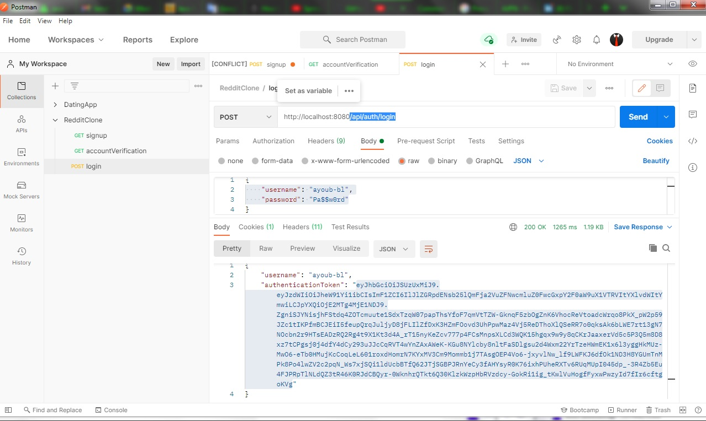

# Reddit Clone
 
| Backend project with J2EE (Spring Boot) |
| ------ |
| Auto-formation |
| Projet `Reddit_Clone_Backend_Spring` (v.0.0.1) |
***********************************************************************
## Features
REST API project for Spring Boot and Angular application, creating a clone of the famous reddit website using JWT and a fake SMTP test server to sign up.

## Tech
- Spring Boot - REST API ( backend )
- Java Mail with Mailtrap ( [Dummy SMTP email] )
- Asynchronous send mails
- Bcrypt Hashing Algorithm ( BCryptPasswordEncoder )
- JWT ( [JSON Web Tokens] )
- Spring Security
- Spring JPA (Hibernate)
- MySQL Database
- Angular ( frontend )
- HTML & ✨Bootstrap✨
 
## Installation
First, you need to run `phpMyAdmin` (your MySQL database manager system), then run the application with Elipse IDE.
💡 `You don't need to create the database manually, it will be created automatically` 😉

## Tests - Screenshots
#### Sign up

#### Received email validation

#### Account verification with token

#### Login with response token and username

## Contact
> `boulahya.ayoub@gmail.com`

> `ayoub.boulahya@etu.univ-amu.fr`

## License
**Free Software, Hell Yeah!**

[Dummy SMTP email]: <https://mailtrap.io/>

[JSON Web Tokens]: <https://jwt.io/>